Try Github 정리
===============
1. git init
> Git repository 생성

------------------------------
2. git status
> 현재 상태를 확인한다
> commit할 파일 없음

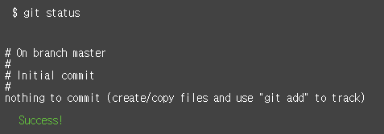
-------------------------------
3. git status
> 현재 상태를 확인한다
> untracked 파일 octocat.txt을 볼 수 있다

-------------------------------
4. git add octocat.txt
> otcocat.txt 파일을 추적한다
> 파일의 변경 내역을 추적하기 위해 Git의 준비 영역으로 파일 추가한다

----------------------------------
5. git status
> git status로 현재 상태를 확인하면 'changes to be commited' 되어있다
> 'changes to be commited'는 octocat.txt파일이 tracked 상태이면서 커밋에 추가될 staged 상태라는 뜻이다

--------------------------------------------------------------------------------------------------------
6. git commit -m "Add cute octocat story"
> 준비 영역에서 변경 내역을 저장소로 저장하기 위해서 남길 메세지와 함께 commit 명령어를 사용한다

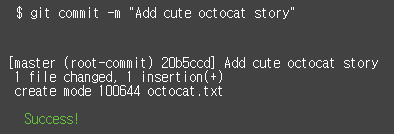

-----------------------------------------------------------------------------------------------
7. git add '*.txt'

> 모든 txt파일을 추적한다
> 파일의 변경 내역을 추적하기 위해 Git의 준비 영역으로 파일 추가한다

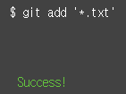
--------------------------------
8. git commit -m 'Add all the octocat txt files'
> 준비 영역에서 변경 내역을 저장소로 저장하기 위해서 남길 메세지와 함께 commit 명령어를 사용한다

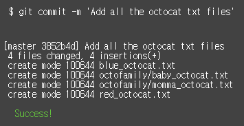
--------------------------------------------------------------------------------------------
9. git log
> commit된 모든 변경 사항에 대한 기록이다

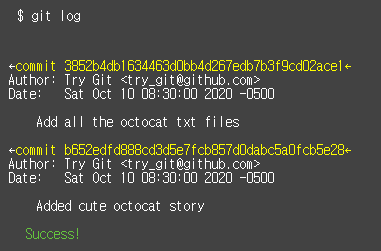
---------------
10. git remote add origin https://github.com/try-git/try_git.git
> 로컬 저장소의 변경 내역을 github 서버에 push하기 위해서 원격저장소를 추가한다

-----------------------
11. git push -u origin master
> push명령어로 origin이라고 지정한 원격 저장소(중앙 저장소)로 보낸다
> origin은 원격 저장소의 이름이고, 기본 로컬 브랜치의 이름은 master이다 
> -u 옵션을 추가하면 다음 push 명령어 실행부터는 원격 저장소와 로컬 브랜치의 이름을 입력하지 않고도 push 할 수 있다

------------
12. git pull origin master
> Github 서버의 변경 내역이 있는지 확인하기 위해서 pull 명령어를 사용해 새로운 변경사항을 가져온다

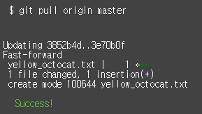
---------------
13. git diff HEAD
> 로컬 저장소의 최종 commit log와 차이점을 보기 위해 diff 명령어를 사용한다
> 가장 최근의 변경 내역을 비교하려면 HEAD포인터를 사용해서 조회 할 수 있다

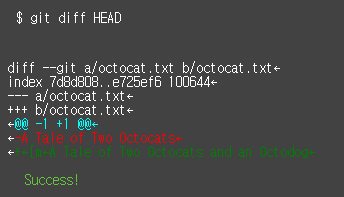
-----------------
14. git add octofamily/octodog.txt
> octofaily 디렉토리 안에 있는 octodog.txt파일을 track한다
> 파일의 변경 내역을 추적하기 위해 Git의 준비 영역으로 파일 추가한다

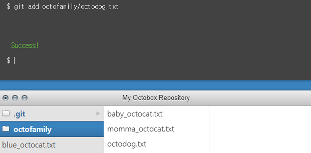
---------------------
15. git diff --staged
> diff명령어로 이미 준비 영역에 있는 파일들과 변경된 점들을 비교한다
> --staged는 commit되기 전의 파일들을 말한다

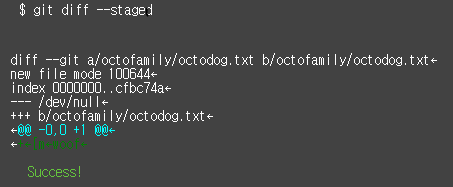
------------------
16. git reset octofamily/octodog.txt
> 준비 영역의 파일을 삭제하기위해 reset명령어를 사용한다

-----------
17. git checkout -- octocat.txt
> octocat.txt파일을 마지막으로 commit된 파일로 되돌려놓는다

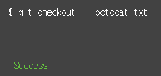
---------------
18. git branch clean_up
> clean_up이라는 새로운 branch를 만든다

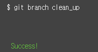
-----------------
19. git checkout clean_up
> checkout 명령어를 이용해 clean_up이라는 branch로 변경한다

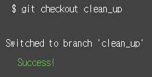
----------------
20. git rm '*.txt'

> 모든 txt파일을 삭제한다
> rm명령어는 준비영역의 파일들을 삭제 할 뿐만 아니라 실제 local repository에 있는 파일도 삭제한다
> 파일을 삭제한 변경 내역도 commit해야한다

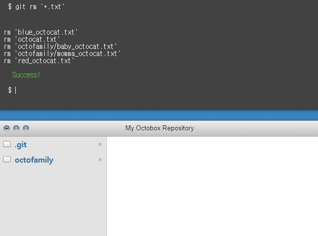
---------------
21. git commit -m "Remove all cats"
> 파일을 삭제한 변경 내역을 commit한다

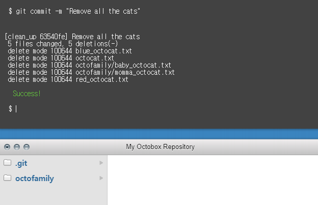
----------------
22. git checkout master
> checkout 명령어를 이용해 master이라는 branch로 변경한다

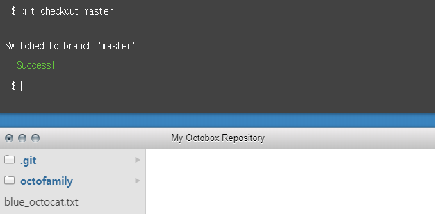
--------
23. git merge clean_up
> clean_up branch를 master branch로 병합한다

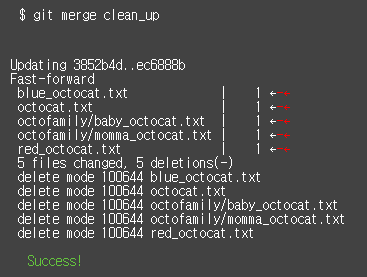
-------
24. git branch -d clean_up
> clean_up brand를 -d 옵션으로 삭제한다

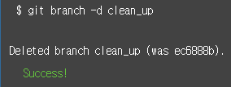
---------
25. git push
> 모든 것이 완료 되면 원격(중앙) 저장소로 push 한다

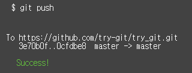
